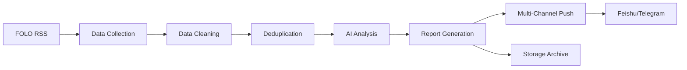

# 🤖 Daily AI Insight

A personal daily AI intelligence pipeline that automatically fetches data from multiple sources, analyzes with LLM, and pushes concise briefings to Feishu and Telegram.

## ✨ Features

- 📊 **Multi-Source Data Collection**: Supports FOLO RSS aggregator, extensible for more sources
- 🧹 **Intelligent Data Cleaning**: Automatic deduplication, spam filtering, quality content retention
- 🤖 **AI Deep Analysis**: Uses Gemini/OpenAI for content analysis and insight generation
- 📝 **Multi-Format Output**: Supports Markdown, Feishu cards, Telegram messages
- ⚡ **Automated Execution**: Daily scheduled runs via GitHub Actions
- 💾 **Data Persistence**: Historical data storage and deduplication management

## 🚀 Quick Start

### 1. Clone Repository

```bash
git clone https://github.com/yourusername/daily-ai-insight.git
cd daily-ai-insight
```

### 2. Install Dependencies

This project uses [uv](https://github.com/astral-sh/uv) for Python dependency management:

```bash
# Install uv (if not already installed)
curl -LsSf https://astral.sh/uv/install.sh | sh

# Install project dependencies
uv venv
uv pip install -e .
```

### 3. Configure Environment Variables

Copy the environment variable template and fill in your configuration:

```bash
cp .env.example .env
```

Edit the `.env` file and fill in necessary API keys and configuration:

```env
# FOLO Configuration
FOLO_COOKIE="your_folo_cookie_here"  # Get from browser F12

# LLM API Keys
GEMINI_API_KEY="your_gemini_api_key"  # Get from Google AI Studio

# Push Channel Configuration
FEISHU_WEBHOOK="https://..."          # Feishu bot webhook
TELEGRAM_BOT_TOKEN="bot_token"        # Telegram bot token
TELEGRAM_CHAT_ID="chat_id"            # Telegram chat ID
```

### 4. Local Run

```bash
# Activate virtual environment
source .venv/bin/activate

# Run full pipeline
python main.py

# Skip data collection, use existing data
python main.py --skip-collection

# Skip AI analysis
python main.py --skip-analysis

# Cleanup old files
python main.py --cleanup
```

## 📋 Configuration Guide

### FOLO Cookie

1. Login to [folo.app](https://folo.app)
2. Open browser DevTools (F12)
3. Switch to Network tab
4. Refresh page
5. Find any request and copy the Cookie field

### Gemini API Key

1. Visit [Google AI Studio](https://makersuite.google.com/app/apikey)
2. Create API Key
3. Copy to `.env` file

### Feishu Webhook

1. Add custom bot in Feishu group
2. Get Webhook URL
3. Copy to `.env` file

### Telegram Bot

1. Chat with [@BotFather](https://t.me/botfather) to create a bot
2. Get Bot Token
3. Send a message to your bot
4. Visit `https://api.telegram.org/bot<TOKEN>/getUpdates` to get Chat ID

## ⚙️ GitHub Actions Automation

### Configure GitHub Secrets

Add the following Secrets in repository settings:

- `FOLO_COOKIE`
- `GEMINI_API_KEY`
- `FEISHU_WEBHOOK`
- `TELEGRAM_BOT_TOKEN`
- `TELEGRAM_CHAT_ID`

### Schedule Time

Default runs daily at UTC 00:00 (Beijing Time 08:00). Modify in `.github/workflows/daily-digest.yml`:

```yaml
schedule:
  - cron: '0 0 * * *'  # Modify here to adjust run time
```

### Manual Trigger

Workflows can be manually triggered on the GitHub Actions page.

## 📁 Project Structure

```
daily-ai-insight/
├── collectors/          # Data collectors
│   ├── base.py         # Base class definition
│   └── folo.py         # FOLO RSS collector
├── processors/          # Data processing
│   ├── cleaner.py      # Data cleaning
│   └── deduper.py      # Deduplication
├── storage/            # Data storage
│   └── manager.py      # Storage management
├── llm/                # AI analysis
│   ├── analyzer.py     # Content analyzer
│   ├── providers/      # LLM providers
│   └── prompts/        # Prompt templates
├── renderers/          # Output rendering
│   ├── markdown.py     # Markdown format
│   ├── feishu.py       # Feishu push
│   └── telegram.py     # Telegram push
├── main.py             # Main entry point
└── .github/
    └── workflows/
        └── daily-digest.yml  # GitHub Actions config
```

## 🔄 Data Flow



## 📊 Output Example

Generated daily reports include:

- **Executive Summary**: Core summary within 100 words
- **Key Points**: 3-5 most important information points
- **Trend Analysis**: Current trends, emerging topics, declining topics
- **Impact Assessment**: Potential impact on industry and technology development
- **Professional Insights**: AI professional insights and commentary
- **Action Recommendations**: Actionable suggestions and areas of focus
- **Recommended Reading**: Curated must-read articles

## 🛠️ Development

### Add New Data Source

1. Create new collector in `collectors/` directory
2. Inherit from `BaseCollector` class
3. Implement `fetch()` method
4. Integrate in `main.py`

### Customize Prompts

Edit `llm/prompts/templates.py` file to adjust AI analysis prompts.

### Add New Push Channel

1. Create new renderer in `renderers/` directory
2. Implement `send()` method
3. Integrate in `main.py`

## 📈 Future Optimizations

- [ ] Add more data sources (HackerNews, Reddit, Twitter)
- [ ] Vector database semantic deduplication
- [ ] Web interface display
- [ ] Personalized recommendation algorithm
- [ ] Multi-language support
- [ ] Data visualization charts

## 📄 License

MIT License

## 🙏 Acknowledgments

- Reference project: [CloudFlare-AI-Insight-Daily](https://github.com/justlovemaki/CloudFlare-AI-Insight-Daily)
- Data source: [FOLO RSS Aggregator](https://folo.app)
- LLM providers: Google Gemini, OpenAI

---

*Powered by Daily AI Insight - Your Personal Intelligence Pipeline* 🤖